# This is Jared Feng 👋

I am: 
- Data scientist/researcher/ML engineer at [Energy Toolbase](https://energytoolbase.com);
- Occasionally also a full-stack dev for different purposes;
- Terminal junkie.

## Fav Tools
Neovim, WSL, Arch Linux, tmux, zsh, LLMs.

## Convictions

I affirm the Apostles Creed, the Nicene Creed, [the Athanasian Creed](https://www.youtube.com/watch?v=SCO0g8hoHuI),
the Chalcedonian Definition, the Five Solas of the Protestant Reformations,
and the [1689 London Baptist Confession of Faith](https://www.the1689confession.com/).

## Quirks
- Nerd Font: JetBrains
- Browser: Any browser with vertical tabs.

## Hall of used tools

  

## Stats

  
  

